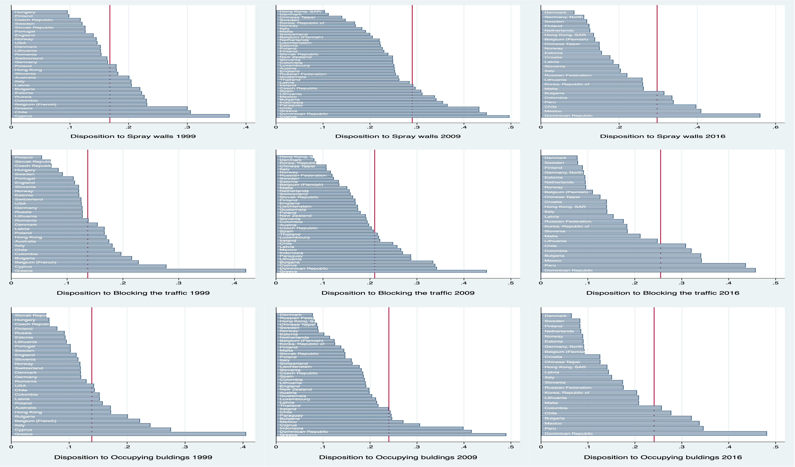
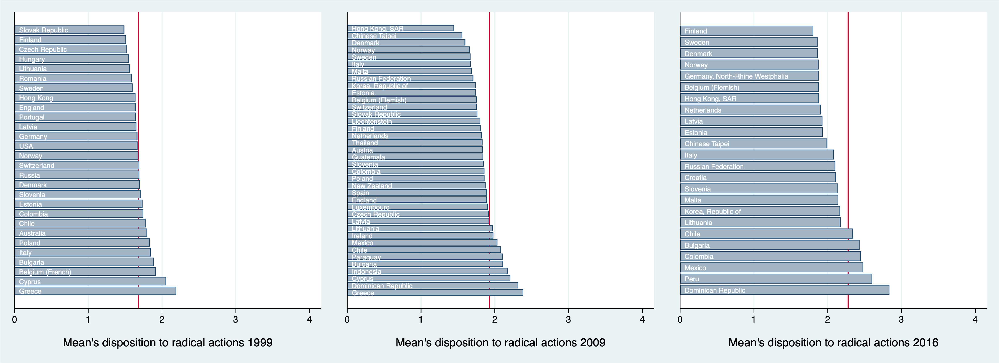
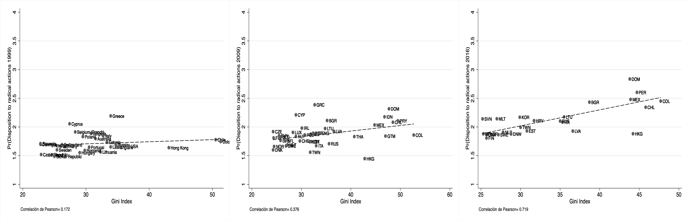
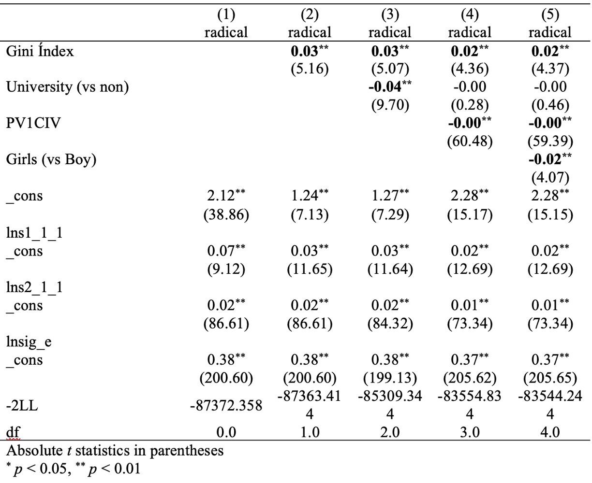
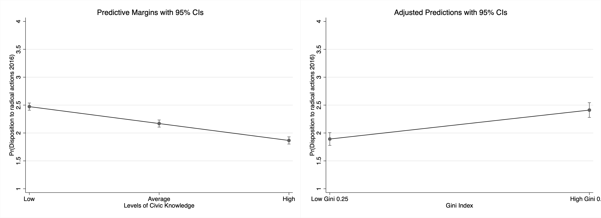
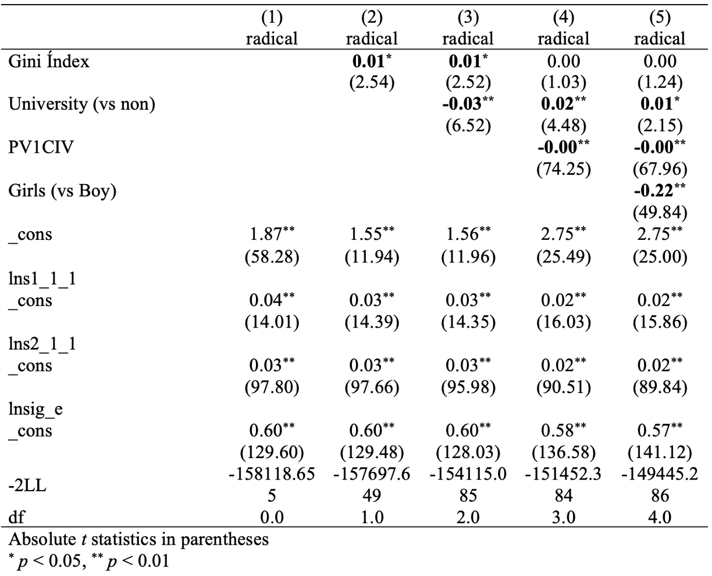
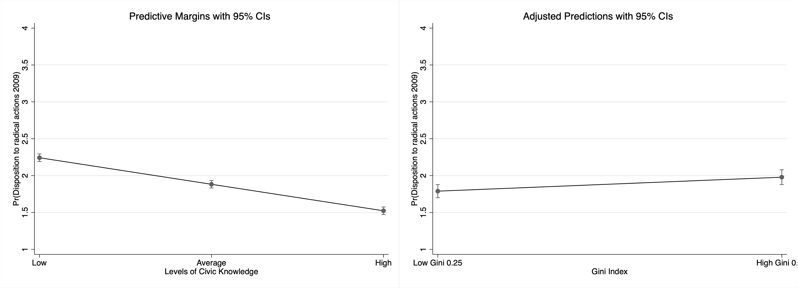
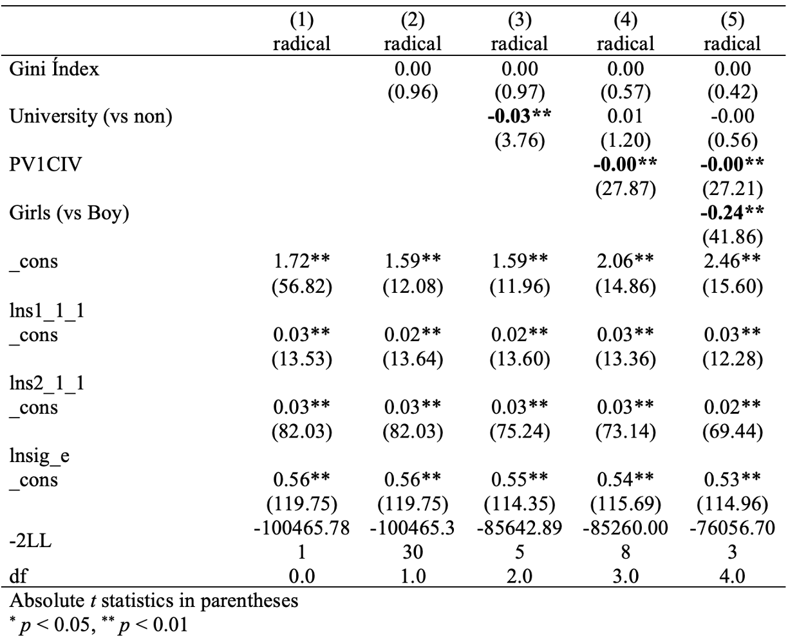
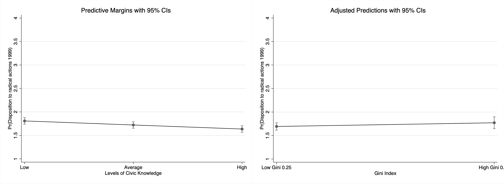

class: front, middle

```{r xaringanExtra, echo=FALSE}
xaringanExtra::use_xaringan_extra(c("tile_view", "animate_css"))
xaringanExtra::use_progress_bar(color = "red", location = "top")

# xaringanExtra::use_share_again()
# xaringanExtra::use_scribble()
```


.pull-left-narrow[
.left[


.smally[
.grey[
Funding: ANID/FONDECYT/11190508
ANID/FONDECYT/1210847
]

.red[
IX Conferencia Internacional - 10 y 11 de Noviembre, 2022]
]

]
]

.medium[
.pull-right-wide[
.right[
.content-box-gray[
## .red[Predisposición de jóvenes a participar en acciones radicales o disruptivas]
<br style="content:''; padding: 0,5px 0;" />
### .text_70[brechas entre países y años]
]]

.content-box-red[
.small[
.red[Daniel Miranda F.]- Centro de Medición MIDE-UC Pontificia Universidad Católica de Chile

.red[Juan C. Castillo] - Dept. of Sociology, Universidad de Chile]
]
]
]

---

layout: true
class: animated, fadeIn


---
class: middle

.pull-left-narrow[
# **PRICE**:
### Programa de Investigación en Ciudadanía Escolar
]

.pull-right-wide[


.right[
[ciudadania-escolar.cl/](https://ciudadania-escolar.cl)
]]


---
class: middle

.pull-left-narrow[
# **PRICE**:
### Programa de Investigación en Ciudadanía Escolar
]]

.pull-right-wide[


.right[
Proyectos de Investigación desde 2011 ]
]


---
.pull-left-narrow[
# **PRICE**:
### Programa de Investigación en Ciudadanía Escolar
]

.pull-right-wide[


]

---
class: inverse animated slideInRight

## .yellow[Predisposición de jóvenes a participar en acciones radicales o disruptivas
]

.pull-right[
.large[
1. Introduction
2. Objectives
3. Methodology
4. Results
5. Discussion
]
]

---
class: inverse animated fadeOutLeft

## .yellow[Predisposición de jóvenes a participar en acciones radicales o disruptivas
]

.pull-right[
.large[
1. .orange[Introduction]
2. Objectives
3. Methodology
4. Results
5. Discussion
]
]
---

.pull-left-narrow[
<br>
## ¿La era de la movilización de masas?
]

.pull-right-wide[
.right[

]]

---
## Los jóvenes y la protesta como fenómeno viejo y nuevo


- Foco en comprensión de causas y consecuencias (efectos en próximas generaciones e instituciones)

---
## Factores relacionados con las protestas

.pull-left[
.content-box-red[
.red[Individual]

- Modelo de recursos de participación: acceso desigual a la voz política

- Conocimiento cívico o político.

- Diferencias de género
]]

.pull-right[
.content-box-yellow[
.red[Contextual]

- Desigualdad económica

- Diversos efectos en diferentes tipos de participación

- Desigualdad y participación juvenil: aún poco claro

]]

---
class: inverse animated slideInRight fadeOutLeft

## .yellow[Predisposición de jóvenes a participar en acciones radicales o disruptivas
]

.pull-right[
.large[
1. Introduction
2. .orange[Objectives]
3. Methodology
4. Results
5. Discussion
]
]
---
# Objetivos

- Evaluar las brechas en cuanto a la disposición de los adolescentes a participar en formas disruptivas o radicales de acciones políticas.

- Comparar diferencias entre países, y a lo largo del tiempo.

- Analizar el papel de las características individuales (educación de los padres, conocimiento y género) en las acciones políticas juveniles

- Evaluar el papel de la desigualdad económica

---
class: inverse animated slideInRight fadeOutLeft

## .yellow[Predisposición de jóvenes a participar en acciones radicales o disruptivas
]

.pull-right[
.large[
1. Introduction
2. Objectives
3. .orange[Methodology]
4. Results
5. Discussion
]
]

---
# Data

- Muestras representativas nacionales utilizando el Estudio Internacional de Cívica y Ciudadanía ICCS, 2009 y 2016.

   + ICCS 2009: 38 países
   + ICCS 2016: 24 países

- Muestras representativas nacionales utilizando CIVED 1999

   + CIVED 1999: 28 países
  
---
## Medidas de participación disponibles en los tres estudios de la IEA

<br>
.content-box-red[
.center[
_Hay muchas maneras diferentes en que los ciudadanos pueden expresar sus opiniones sobre temas importantes en la sociedad. ¿Participarías en alguna de las siguientes actividades para expresar tu opinión en el futuro?_
]]

---
.content-box-red[
### Predisposición a acciones **disruptivas**
- Eslóganes de protesta con pintura en aerosol en las paredes
- Participar de una protesta controlando el tráfico
- Ocupar edificios públicos en señal de protesta
]

<br>
.medium[
*Escala de respuesta: 1-Ciertamente no haría esto, 2-Probablemente no haría esto, 3-Probablemente haría esto, 4-Ciertamente haría esto*
]

---
## Variables independientes

- Índice de Gini: obtenido de la base de datos de desigualdad de ingresos mundial normalizada (https://fsolt.org/swiid/).

- Nivel educativo de los padres: el nivel más alto registrado como 0 *No universitario* y 1 *Universitario*

- Conocimiento cívico: Un valor plausible en ICCS 2009 y 2016. En CIVED 1999 se utilizó la escala proporcionada.

- Sexo del alumno.


---
## Métodos

- Análisis descriptivos

- Modelos multinivel (efectos aleatorios)

---
class: inverse animated slideInRight fadeOutLeft

## .yellow[Predisposición de jóvenes a participar en acciones radicales o disruptivas
]

.pull-right[
.large[
1. Introduction
2. Objectives
3. Methodology
4. .orange[Results]
5. Discussion
]
]


---
### Tipos de acción política

```{r, echo=FALSE, out.width = '80%', fig.retina = 1, fig.align='center'}


```

---
### Tipos de acción política

```{r, echo=FALSE, out.width = '100%', fig.retina = 1, fig.align='center'}


```


---
### Desigualdad

```{r, echo=FALSE, out.width = '140%', fig.retina = 1, fig.align='center'}


```

---
### ICCS 2016

```{r, echo=FALSE, out.width = '60%', fig.retina = 1, fig.align='center'}

```

---
### Conocimiento cívico y Gini - 2016

```{r, echo=FALSE, out.width = '110%', fig.retina = 1, fig.align='center'}

```


---
### ICCS 2009

```{r, echo=FALSE, out.width = '60%', fig.retina = 1, fig.align='center'}

```

---
### Conocimiento cívico y Gini - 2009

```{r, echo=FALSE, out.width = '110%', fig.retina = 1, fig.align='center'}

```


---
### CIVED 1999

```{r, echo=FALSE, out.width = '60%', fig.retina = 1, fig.align='center'}

```

---
### Conocimiento cívico y Gini - 1999

```{r, echo=FALSE, out.width = '110%', fig.retina = 1, fig.align='center'}

```

---
class: inverse animated slideInRight fadeOutLeft

## .yellow[Predisposición de jóvenes a participar en acciones radicales o disruptivas
]

.pull-right[
.large[
1. Introduction
2. Objectives
3. Methodology
4. Results
5. .orange[Discussion]
]
]

---
## Discusión

- La disposición a participar en acciones radicales aumentó entre 1999, 2009 y 2016, pero con variación entre países en esos patrones.

- Slogans parece ser una predisposición más común que bloquear el tráfico, y ambas son más comunes que ocupar edificios

- Los países latinoamericanos tienden a estar en la parte superior de la lista acciones políticas.

---
## Discusión: desigualdad

- En contextos más desiguales los estudiantes tienden a mostrar mayor predisposición a participar en acciones disruptivas. Estos resultados aparecen principalmente en 2016, menos claros en 2009 y no se observan en 1999.

- Para el caso de acciones radicales, el contexto desigual parece importar más en los últimos años.

- Los resultados apoyan la idea de que las desigualdades generan mayor conflictividad en la sociedad.

---
## Discusión: Factores individuales

Pero, la educación (vía transmisión de conocimientos cívicos) tiene el potencial de desincentivar este tipo de acciones.

- Papel relevante del conocimiento cívico: tiende a disminuir la participación en acciones radicales.

- Los recursos importan de dos maneras: transmisión intergeneracional de habilidades cívicas.

- Diferencias de género: las niñas tienden a mostrar menor predisposición que los niños a las acciones radicales pero las diferencias parecen acortarse a lo largo del tiempo.

---
# Próximos pasos

- Combinando los datos

- Comparabilidad de las medidas de participación

- Algunos desafíos: armonización de la escala de conocimiento cívico.


---
class: inverse middle center

# .yellow[!Gracias por su atención!]

More information in: [.orange[ciudadania-escolar.cl]](https://ciudadania-escolar.cl/)

---
class: front middle

.pull-left-narrow[
.left[


.smally[
.grey[
Funding: ANID/FONDECYT/11190508
ANID/FONDECYT/1210847
ANID/FONDAP/COES
]

.red[
IX Conferencia Internacional - 10 y 11 de Noviembre, 2022]
]

]
]


.medium[
.pull-right-wide[
.right[
.content-box-gray[
## .red[Predisposición de jóvenes a participar en acciones radicales o disruptivas]
<br style="content:''; padding: 0,5px 0;" />
### .text_70[brechas entre países y años]
]]

.content-box-red[
.small[
.red[Daniel Miranda F.]- Centro de Medición MIDE-UC Pontificia Universidad Católica de Chile

.red[Juan C. Castillo] - Dept. of Sociology, Universidad de Chile]
]
]
]


