class: front, middle

```{r xaringanExtra, echo=FALSE}
xaringanExtra::use_xaringan_extra(c("tile_view", "animate_css"))
xaringanExtra::use_progress_bar(color = "red", location = "top")

# xaringanExtra::use_share_again()
# xaringanExtra::use_scribble()
```


.pull-left-narrow[
.left[


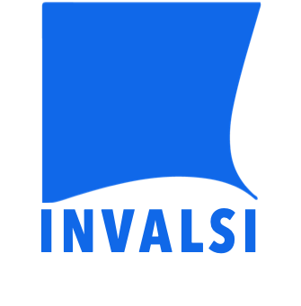

.smally[
.grey[
Funding: ANID/FONDECYT/11190508
ANID/FONDECYT/1210847
]

.red[
VII Seminar INVALSI Rome. Italy - October 28, 2022]
]

]
]


.pull-right-wide[
.right[
.content-box-gray[
## .red[Youth dispositions to participate in disruptive and pacific actions]
<br style="content:''; padding: 0,5px 0;" />
### .text_70[Gaps across countries and years]
]

.content-box-red[
.small[
.red[Daniel Miranda F.]- Centro de Medición MIDE-UC Pontificia Universidad Católica de Chile

.red[Juan C. Castillo] - Dept. of Sociology, Universidad de Chile]
]
]
]

---

layout: true
class: animated, fadeIn


---
class: middle

.pull-left-narrow[
# **PRICE**:
## Research Program on School Citizenship
]

.pull-right-wide[


.right[
[ciudadania-escolar.cl/](https://ciudadania-escolar.cl)
]]


---
class: middle

.pull-left-narrow[
# **PRICE**:
## Research Program on School Citizenship
]

.pull-right-wide[


.right[
Research projects from 2011 ]
]


---
.pull-left-narrow[
# **PRICE**:
## Research Program on School Citizenship
]

.pull-right-wide[


]

---
class: inverse animated slideInRight

## .yellow[Youth dispositions to participate in disruptive and pacific actions
]

.pull-right[
.large[
1. Introduction
2. Objectives
3. Methodology
4. Results
5. Discussion
]
]

---
class: inverse animated fadeOutLeft

## .yellow[Youth dispositions to participate in disruptive and pacific actions
]

.pull-right[
.large[
1. .orange[Introduction]
2. Objectives
3. Methodology
4. Results
5. Discussion
]
]
---

.pull-left-narrow[
<br>
## The age of mass movilization?
]

.pull-right-wide[
.right[
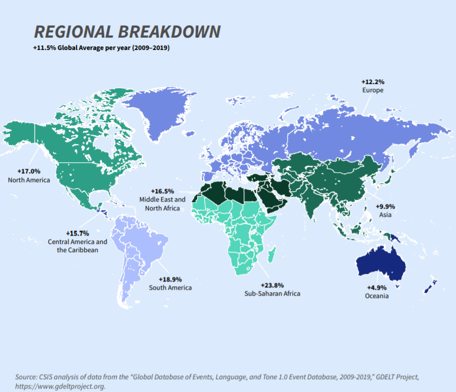
]]

---
## Young people and protest as an old and new phenomenon


- Scarce knowlege about causes and consequences, for next generations and institutions

---
## Factors related to protests

.pull-left[
.content-box-red[
.red[Individual]

- Resources model of participation: unequal access to political voice

- Civic or political knowledge 

- Gender differences
]]

.pull-right[
.content-box-yellow[
.red[Contextual]

- Economic inequality 

- Diverse effects on different participation types

- Inequality and youth participation: still unclear

]]

---
class: inverse animated slideInRight fadeOutLeft

## .yellow[Youth dispositions to participate in disruptive and pacific actions
]

.pull-right[
.large[
1. Introduction
2. .orange[Objectives]
3. Methodology
4. Results
5. Discussion
]
]
---
# Objectives

- To assess gaps regarding adolescents' willingness to participate in radical and pacific forms of political actions

- To compare differences between countries and over time.

- To analyze the role of individual characteristics (parent's education, civic knowledge and gender) on youth political actions

- To evaluate the role of economic inequality 


---
class: inverse animated slideInRight fadeOutLeft

## .yellow[Youth dispositions to participate in disruptive and pacific actions
]

.pull-right[
.large[
1. Introduction
2. Objectives
3. .orange[Methodology]
4. Results
5. Discussion
]
]

---
# Data

- National representative samples using International Civic and Citizenship Study ICCS, 2009 and 2016.

  + ICCS 2009: 38 countries
  + ICCS 2016: 24 countries

- National representative samples using CIVED 1999

  + CIVED 1999: 28 countries
  
---
## Measures of participation available on the three IEA studies**

<br>
.content-box-red[
.center[
_There are many different ways how citizens may express their opinions about important issues in society. Would you take part in any of the following activities to express your opinion in the future? _
]]
---
.pull-left[

.content-box-green[
### Disposition to **pacific** actions
- Contact an elected representative
- Take part in a peaceful march or rally
- Colect signatures for a petition
]
]
.pull-right[
.content-box-red[
### Disposition to **disruptive**  actions*
- Spray-paint protest slogans on walls
- Stage a protest by clocking traffic
- Occupy public buldings as a sign of protest
]]
<br>
.medium[
*Response scale: 1- I would certainly not do this, 2-I probably not do this, 3-I would probably do this, 4-I would certainly do this*
]

---
## Independent Variables

- Gini Index: obtained from the Standadized World Income Inequality Database (https://fsolt.org/swiid/). 

- Parents educational level: the highest level recoded as 0 *Non univerity* and 1 *University*

- Civic knowledge: One plasible value in ICCS 2009 and 2016. In CIVED 1999 were used the provided scale.

- Sex of the student.


---
## Methods

- Descriptive analyses

- Multilevel (random effects) models

---
class: inverse animated slideInRight fadeOutLeft

## .yellow[Youth dispositions to participate in disruptive and pacific actions
]

.pull-right[
.large[
1. Introduction
2. Objectives
3. Methodology
4. .orange[Results]
5. Discussion
]
]


---
### Political actions across studies
.center[
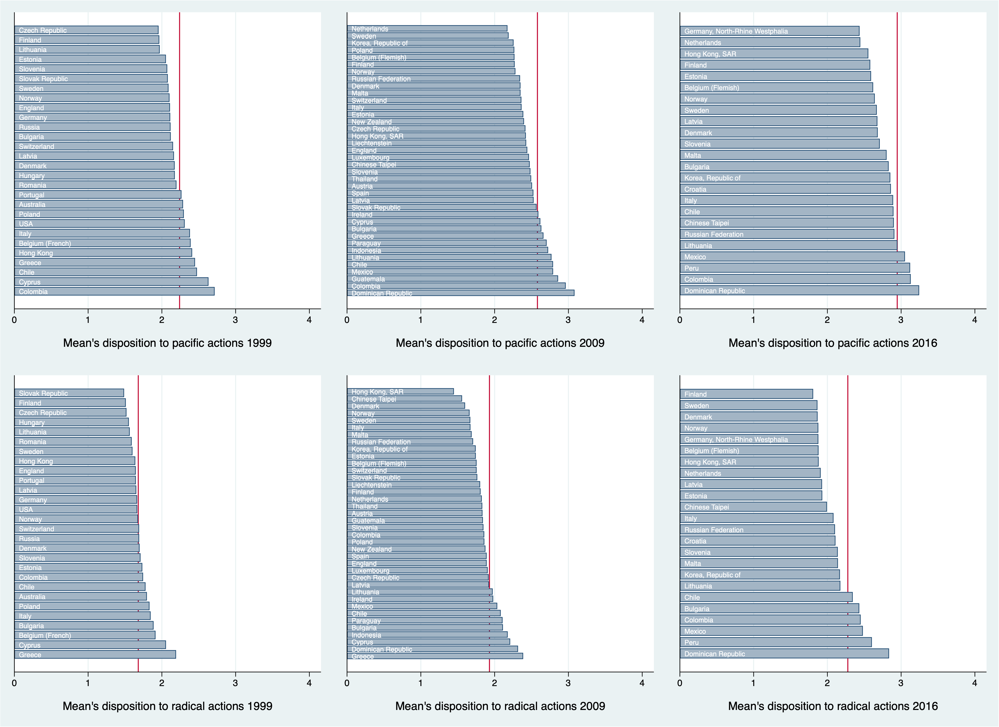
]
---
## Inequality

```{r, echo=FALSE, out.width = '100%', fig.retina = 1, fig.align='center'}
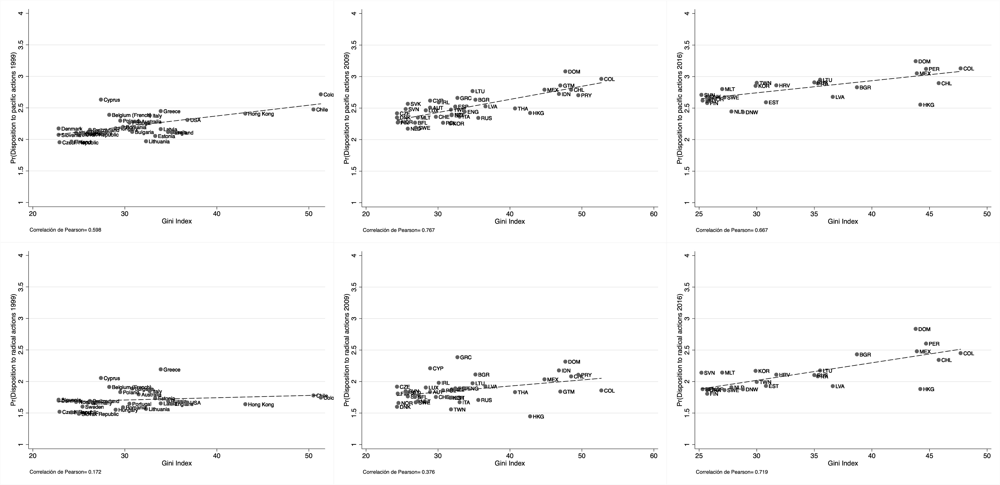

```


---
## ICCS 2016

```{r, echo=FALSE, out.width = '110%', fig.retina = 1, fig.align='center'}
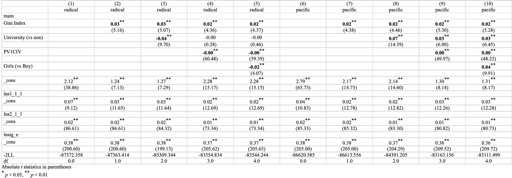
```

---
### Gini - 2016

```{r, echo=FALSE, out.width = '110%', fig.retina = 1, fig.align='center'}
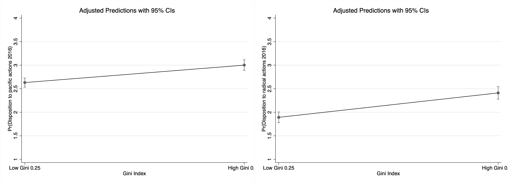
```


---
### Civic Knowledge - 2016

```{r, echo=FALSE, out.width = '110%', fig.retina = 1, fig.align='center'}
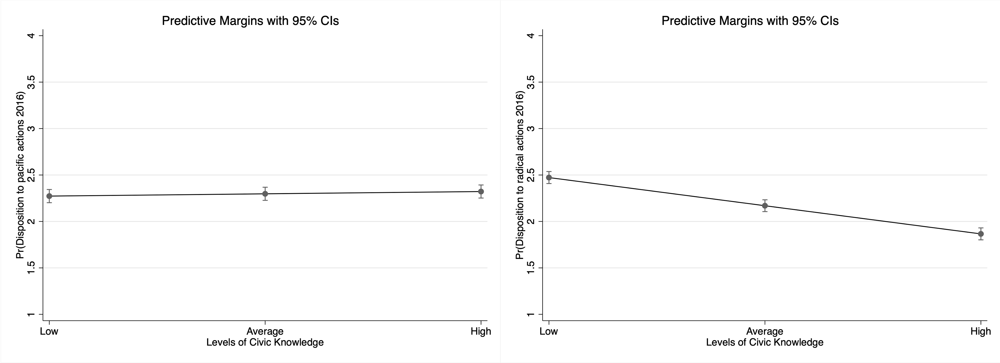
```


---
## ICCS 2009

```{r, echo=FALSE, out.width = '110%', fig.retina = 1, fig.align='center'}
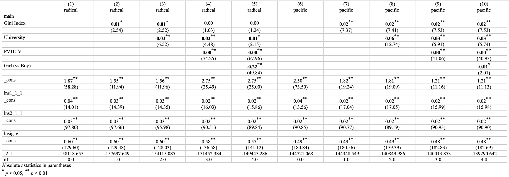
```

---
## Gini - 2009

```{r, echo=FALSE, out.width = '110%', fig.retina = 1, fig.align='center'}
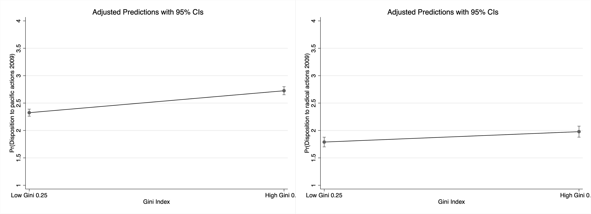
```


---
## Civic Knowledge - 2009

```{r, echo=FALSE, out.width = '110%', fig.retina = 1, fig.align='center'}
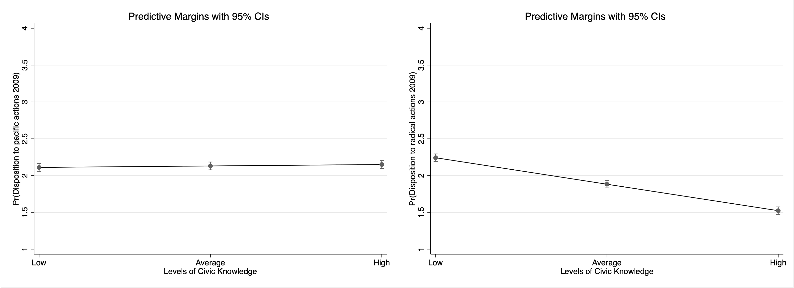
```

---
## CIVED 1999

```{r, echo=FALSE, out.width = '110%', fig.retina = 1, fig.align='center'}
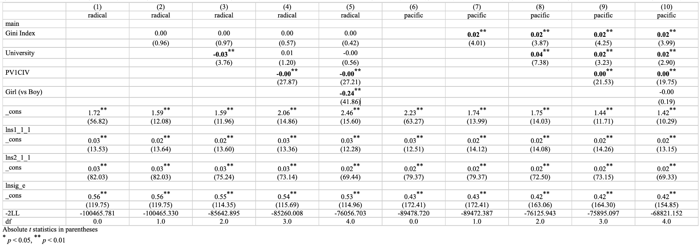
```

---
## Gini - 1999

```{r, echo=FALSE, out.width = '110%', fig.retina = 1, fig.align='center'}
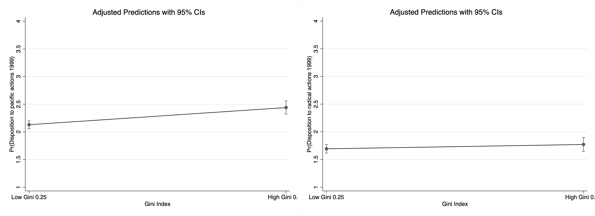
```


---
## Civic Knowledge - 1999 

```{r, echo=FALSE, out.width = '110%', fig.retina = 1, fig.align='center'}
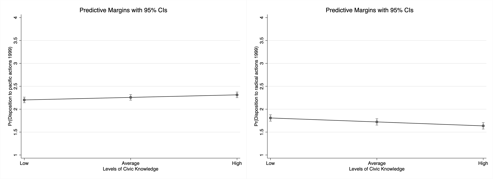
```


---
class: inverse animated slideInRight fadeOutLeft

## .yellow[Youth dispositions to participate in disruptive and pacific actions
]

.pull-right[
.large[
1. Introduction
2. Objectives
3. Methodology
4. Results
5. .orange[Discussion]
]
]

---
## Discussion

- Student are more willing to participate in pacific than in radical actions.

- Both types of willingness tend to increase between 1999, 2009 and 2016.

- Latin American countries tend to be in top of the list in both types of participation.

---
## Discussion: inequality


- In more unequal contexts students tend to show higher disposition to participate in pacific actions. This results appear in 1999, 2009 and 2016.

- For the case of radical actions, unequal context seem to matter more in recent years.

- the results support the idea that inequalities generate more conflicts in society.

---
## Discussion: Individual factors

- Civic knowledge relevant role: tends to increase participation in pacific actions and decrese participation in radical actions. 

- Resources matters in two ways: intergenerational transmission of civic skills.

- Gender differences: girls tend to show lower dispositions than boys for radical actions but the differences seems to be shortened across time.

---
## Next steps

- Combining the data: some challenges about homologation of civic Knowledge scale.


---
class: inverse middle center

# .yellow[Thanks for your attention!]

More information in: [.orange[ciudadania-escolar.cl]](https://ciudadania-escolar.cl/)

---
class: front middle
.pull-left-narrow[
.left[


.small[
.grey[
Funding: ANID/FONDECYT/11190508
ANID/FONDECYT/1210847
]

<br>
<br>
<br>
<br>
<br>
<br>
.red[
VII Seminar INVALSI Rome. Italy - October 28, 2022]
]

]
]


.pull-right-wide[
.right[
.content-box-gray[
## .red[Youth dispositions to participate in disruptive and pacific actions]
<br style="content:''; padding: 0,5px 0;" />
### .text_70[Gaps across countries and years]
]

.content-box-red[
.small[
.red[Daniel Miranda F.]- Centro de Medición MIDE-UC Pontificia Universidad Católica de Chile

.red[Juan C. Castillo] - Dept. of Sociology, Universidad de Chile]
]
]
]


