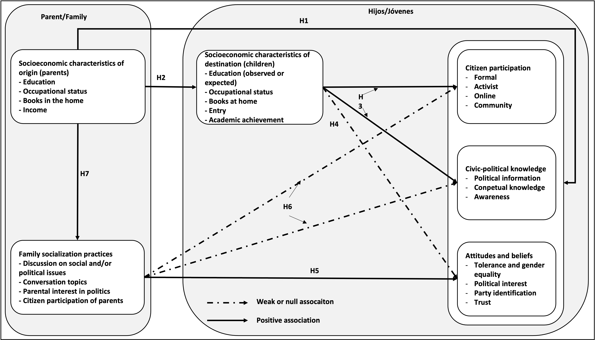
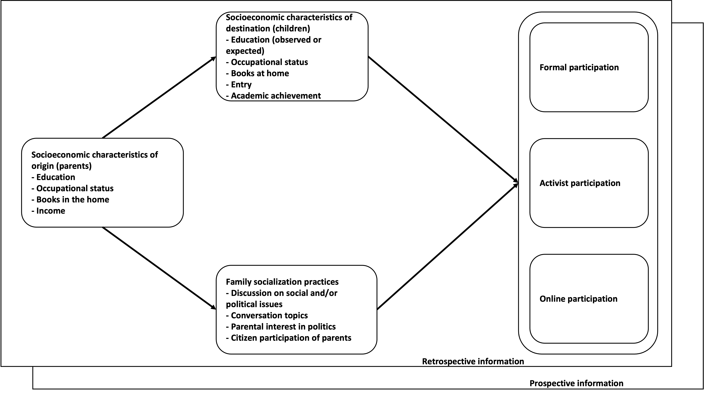
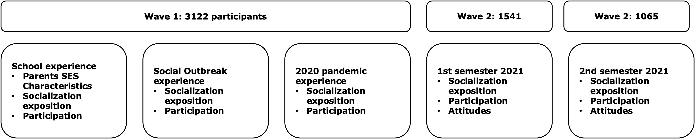
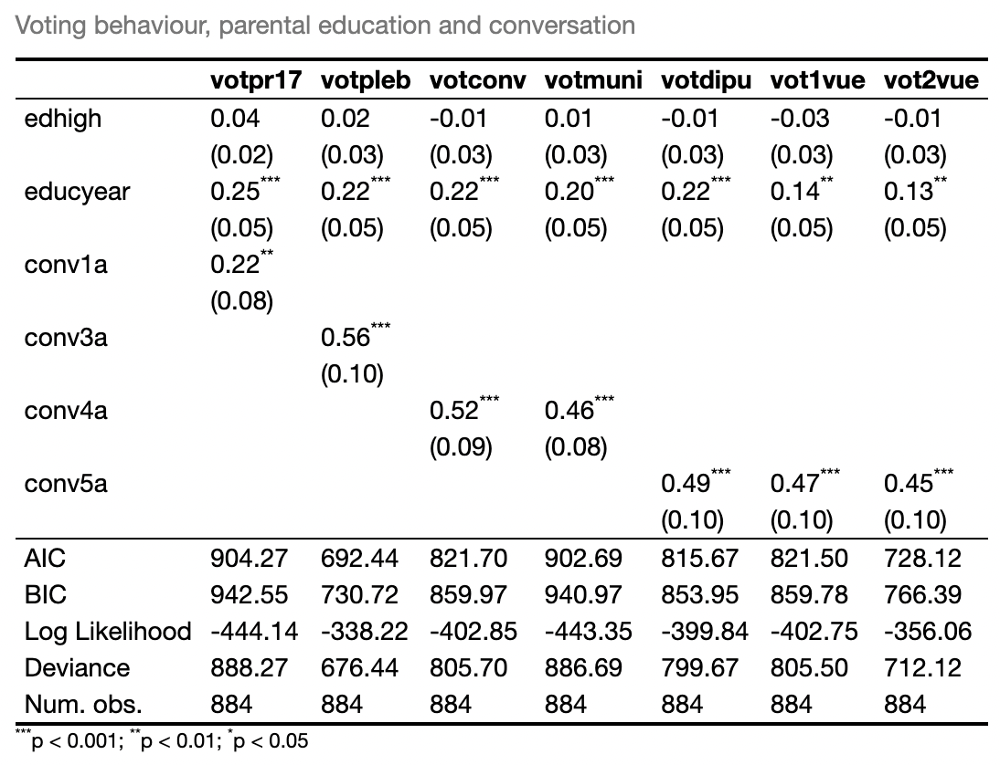
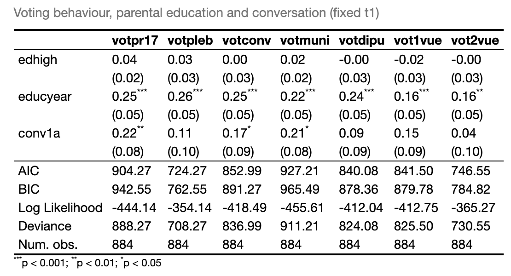
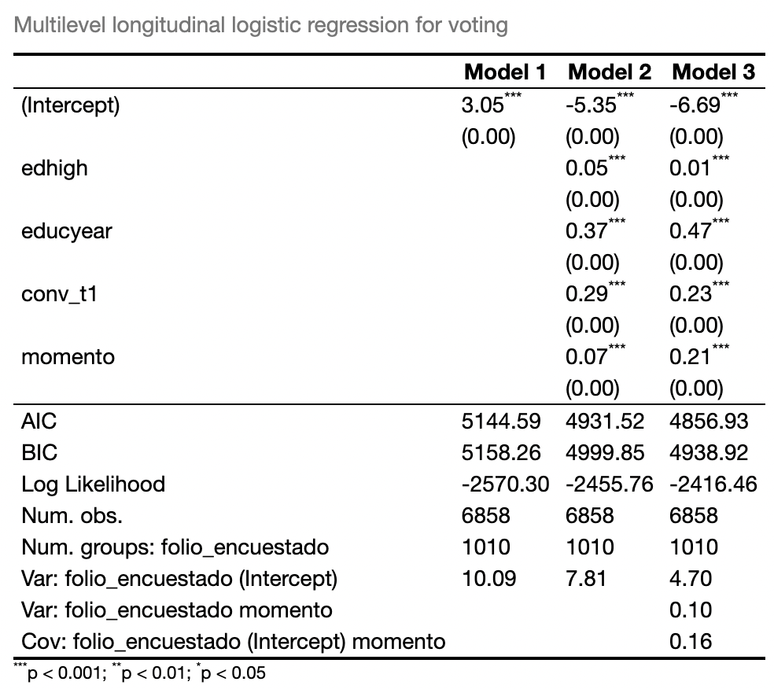
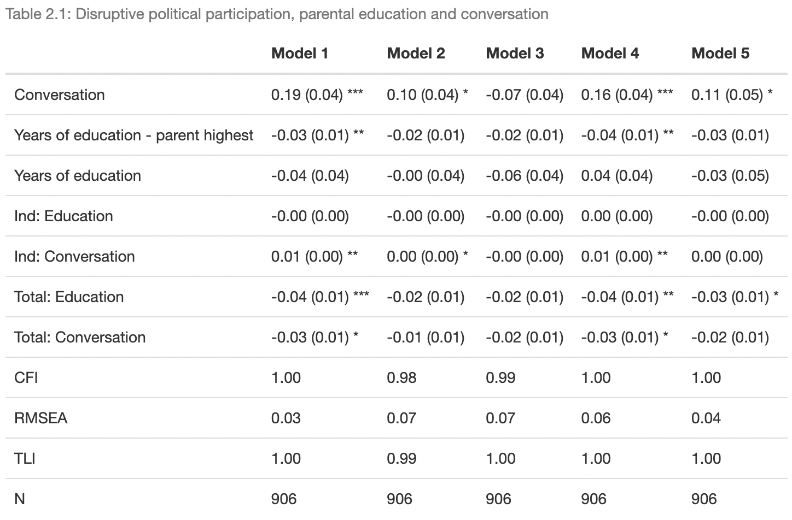

```{r setup_theme, include = FALSE}

light_color <- 'white'
text_color <- '#397CDA'
gray <- "#333333"
blue <- "#4466B0"


library(xaringanthemer)
style_duo(
  # colors
  primary_color = light_color,
  secondary_color = text_color,
  header_color = light_color,
  text_color = text_color,
  code_inline_color = colorspace::lighten(text_color),
  text_bold_color = colorspace::lighten(text_color),
  link_color = text_color,
  title_slide_text_color = text_color,
  background_position = 'center',
  header_font_google = google_font("Lato"),
  text_font_google   = google_font("Lato", "300", "300i"),
  code_font_google   = google_font("Hack"),
  code_highlight_color = 'rgba(58,116,188,0.15)',
  code_font_size = '50%',
  padding = "0.4em 2.4em 0.4em 2.4em",
  extra_fonts = list(google_font("Lato")),
  extra_css = 
  list(
  ".red"    = list(color = "red"),
  ".white"  = list(color = "white"),
  ".bold_white" = list(color = "white", "font-weight" = "bold"),
  ".small" = list("font-size" = "90%"),
  ".pull_l_70"  = list("float" = "left" , "width" = "72%"),
  ".pull_r_30"  = list("float" = "right", "width" = "23%"),
  ".pull_l_60"  = list("float" = "left" , "width" = "60%"),  
  ".pull_r_40"  = list("float" = "right", "width" = "33%"),
  ".pull_l_50"  = list("float" = "left" , "width" = "45%"),
  ".pull_r_50"    = list("fixed" = "right", "width" = "45%"),
  ".small_left"  = list("float" = "left", "width" = "47%", "height" = "50%", "padding-right" = "2%"),
  ".small_right" = list("float" = "right","width" = "47%", "height" = "50%", "padding-left"  = "2%"),
  ".left_code" = list("float" = "left",  "width" = "47%", "height" = "100%", "padding-right" = "2%",
    "font" = "Hack"),
  ".code_out"  = list("float" = "right", "width" = "47%", "height" = "100%", "padding-left"  = "2%",
    "font" = "Hack"),
  ".pull_l_50_1" = list(
    display = "flex",
    width   = "100%",
    height   = "77%",
    "flex-flow" = "column wrap",
    flex    = "1",
    "padding-left"  = "10%"
  ),
  ".pull_l_50_2" = list(
    display = "flex",
    width   = "100%",
    height   = "10%",
    "flex-flow" = "column wrap",
    flex    = "2",
    "padding-left"  = "10%"
  ),  
  ".text_250" = list("font-size" = "250%"),
  ".text_240" = list("font-size" = "240%"),
  ".text_230" = list("font-size" = "230%"),
  ".text_220" = list("font-size" = "220%"),
  ".text_210" = list("font-size" = "210%"),
  ".text_200" = list("font-size" = "200%"),
  ".text_190" = list("font-size" = "190%"),
  ".text_180" = list("font-size" = "180%"),
  ".text_170" = list("font-size" = "170%"),
  ".text_160" = list("font-size" = "160%"),    
  ".text_150" = list("font-size" = "150%"),
  ".text_140" = list("font-size" = "140%"),  
  ".text_130" = list("font-size" = "130%"),
  ".text_120" = list("font-size" = "120%"),
  ".text_110" = list("font-size" = "110%"),
  ".text_110" = list("font-size" = "110%"),
  ".text_100" = list("font-size" = "100%"),
  ".text_90" = list("font-size" = "90%"),
  ".text_80" = list("font-size" = "80%"),
  ".text_70" = list("font-size" = "70%"),
  ".text_60" = list("font-size" = "60%"),
  ".text_50" = list("font-size" = "50%"),
  ".text_40" = list("font-size" = "40%"),
  ".text_30" = list("font-size" = "30%"),
  ".text_20" = list("font-size" = "20%"),
  ".line_space_11" = list("line-height" = "1.1em;"),
  ".line_space_09" = list("line-height" = "0.9em;"),
  ".line_space_07" = list("line-height" = "0.7em;"),
  ".line_space_05" = list("line-height" = "0.5em;"),
  ".line_space_04" = list("line-height" = "0.4em;"),
  ".line_space_03" = list("line-height" = "0.3em;"),
  ".line_space_02" = list("line-height" = "0.2em;"),
  ".line_space_01" = list("line-height" = "0.1em;"),
    ".french" = list(
      "text-indent" = "-30px", 
      "position"= "absolute%",
      "padding-left"= "40px%"
      ),

    ".tiny_text" = list(
      "font-family" = "Lato", 
      "font-size"= "70%"
      ),
    ".large_text" = list(
      "font-family" = "Lato", 
      "font-size"= "150%"
      ),
    ".slide_blue" = list(
      "background-color" = "#397CDA",
      "color" = "white"
      ),
  ".center_image" = list(
    margin  = "0",
    position = "absolute",
    top      = "50%",
    left     = "50%",
    '-ms-transform' = "translate(-50%, -50%)",
    transform = "translate(-50%, -50%)"
    ),
  ".hljs-github .hljs" = list(
    background = 'rgba(58,116,188,0.03)')
  )
)


# 'rgba(25,142,255,0.3)',

knitr::opts_chunk$set(comment = NA)
knitr::opts_chunk$set(dpi=1500)

# preview slides
# xaringan::inf_mr('psi2301_slide_example.rmd')


# padding-top: 0.4em;
# padding-right: 2.4em;
# padding-bottom: 0.4em;
# padding-left: 2.4em;

```
class: title-slide, middle, center

background-image: url(img/mide_logo_2019.png), url(img/coes.png)
background-position: top left, top right
background-size: 15%, 10%

```{r echo=FALSE, out.width = '2%', out.height = '2%'}
knitr::include_graphics('./img/blank_space.png')
```

<br>

.line_space_07[
## Youth Citizen Participation:
### .text_70[Between social reproduction and political socialization.]
]
<br>

.line_space_03[
.blue[

.text_70[

.text_70[**Daniel Miranda. Contact**: **damiran1@uc.cl**]

.text_70[**Measurement Center MIDE UC **]

.text_70[**Centro de Estudios de Conflicto y Cohesión Social - COES**]


]

<br>

.line_space_02[
.text_70[**Funding Project ANID/FONDECYT/11190508**]
]

<br>

.text_70[**Visiting Scholar Seminar**]

.text_70[**Department of Education, University of Bath**]

.text_70[Bath, UK - October 22, 2022]
]
]

<br>

---
class: inverse upper
# Outline

1. Research agenda

2. General model: objetictives and hypotheses

3. Data: Youth Citizenship Panel Study

4. Results

5. Discussion

---
**Research Program on School Citizenship PRICE**

```{r, echo=FALSE, out.width = '30%', fig.retina = 1, fig.align='center'}
knitr::include_graphics("files/price.png")
```

 .text_70[
**url:** [https://ciudadania-escolar.cl/](https://ciudadania-escolar.cl/)
  ]

- Proyecto FONDECYT de regular 1210847 (2021-2024): **Moral foundations of the educational market and its implications for citizenship education in Chile**. Investigador principal: Juan Carlos Castillo <br> 

- Proyecto FONDECYT de Iniciación 11221143 (2022-2024): **Political socialization and citizenship education in Chile: a study on gender differences, gaps and biases in the school context**. Investigador principal: Camila Jara <br> 

- Proyecto FONDECYT de Iniciación 11190508 (2019-2022): **Youth citizen participation: between reproduction and political socialization**. Investigador principal: Daniel Miranda <br>

- Proyecto FONDECYT de regular 1181239 (2019-2022): **Political socialization and education for citizenship: the role of the family and the school**. Investigador principal: Cristián Cox <br>

- Proyecto FONDECYT de regular 1120630 (2012-2015): **Political socialization and school experience - Chile in international context**. Investigador principal: Cristián Cox <br>

---
**Context: FONDECYT project 11190508 (2019-2022)**

- Proyect: **Youth Citizen Participation:Between social reproduction and political socialization.** <br> <br>

- Principal Investigator: Daniel Miranda <br> <br>

---
**Introduction**

What are the factors and mechanisms that explain the intergenerational transmission of political inequality?

- Typologies of political participation

  + What is political participation for youth?
  + Continous expansion of repertoires
  + Theoretical and practical challenges

- Socialization of citizenship
  
  + Agents of socialization

- Different theories
  
  + Persistence or lifetime openness
  + Impresionable years
  + Lifecycle perspective

---
**Introduction**

- Socioeconomic inequality and political participation

   - Intergenerational transmission of political inequality: Transmission of status - resource model.
  
   - Intergenerational transmission of beliefs, identities, behavior: socialization model.
  
---
**Research question**

- To what extent is the association between family socioeconomic conditions and different types of citizen participation produced indirectly, through the transmission of resources from one generation to another?

- To what extent is the association between socioeconomic conditions of the family with different types of citizen participation produced indirectly, as a propensity of families to politically socialize the next generation?

- To what extent are the direct and/or indirect processes of intergenerational transmission of political inequality persistent over time?

---
**General Hypotetic Model**

```{r, echo=FALSE, out.width = '80%', fig.retina = 1, fig.align='center'}

```

---
**Hypotetic Model**

```{r, echo=FALSE, out.width = '80%', fig.retina = 1, fig.align='center'}

```

---
**Youth Citizenship Panel Study**

The sample corresponds to young Chileans aged between 18 and 30 years. The study design has a longitudinal nature of three measurements:

- Wave 1: started on July 19, 2021. N= 3122

During the first measurement, a series of retrospective questions is implemented with the aim of characterizing the political behavior, cultural and socioeconomic resources of young people and their families during the period that refers to their secondary, tertiary and recent studies.

The following measurements characterize the behavior and political attitudes during the recent period (first and second semester of 2021, respectively)

- Wave 2: started on October 04, 2021. N= 1541
- Wave 3: started on December 30, 2021. N= 1065

```{r, echo=FALSE, out.width = '80%', fig.retina = 1, fig.align='center'}

```

---
**Measures of participation**

During your high school period, did you do any of the following activities? Never, Rarely, Sometimes, Frequently
- Vote in student elections
- Be a candidate
- Being part of the student center
- Participate in peaceful marches
- Participate in marches with riots
- Participate in street blockade
- Paint or stripe walls with slogans
- Participate in taking over buildings
- Voluntary work
- Sign a petition
- Money collections
- Share or create online political content
- Follow people for political reasons
- Liking content for political reasons

---
**Measures of participation**

Now thinking about the period of the social outbreak, between October 2019 and January 2020, did you carry out any of the following activities? Never, Rarely, Sometimes, Frequently
- Sign a petition
- Participate in peaceful marches
- Participate in marches with riots
- Participate in street blockade
- Paint or stripe walls with slogans
- Participate in taking over buildings
- Voluntary work
- Sign a petition
- Money collections
- Share or create online political content
- Follow people for political reasons
- Liking content for political reasons

Now thinking about the period of the social outbreak, between October 2019 and January 2020, did you carry out any of the following activities?

Considering the last months, during the first semester of 2021, did you carry out any of the following activities?

Considering the last months, during the second semester of 2021, did you carry out any of the following activities?

---
**Measures of participation**

Participants were asked about their participation in different elections during las years 
- Voting in 2017 presidential election
- Referendum about new constitution 2020
- Municipal elections
- Election of constitutional convention members
- Presideintial election in 2021 (1st and 2nd round)

---
**Independent Measures**

- Parents educational level

- Own educational level

- Frequency of conversation on social and political issues

---
**Results: electoral participation**

```{r, echo=FALSE, out.width = '60%', fig.retina = 1, fig.align='center'}

```

---
**Results: electoral participation**

```{r, echo=FALSE, out.width = '60%', fig.retina = 1, fig.align='center'}

```

---
**Results: electoral participation**

```{r, echo=FALSE, out.width = '60%', fig.retina = 1, fig.align='center'}

```


---
**Results: online pariticipation index**

- Invariant across time

```{r, echo=FALSE, out.width = '75%', fig.retina = 1, fig.align='center'}
knitr::include_graphics("files/online_model.png")
```

---
**Results: disruptive participation index**

- Invariant across time

```{r, echo=FALSE, out.width = '70%', fig.retina = 1, fig.align='center'}

```


---
**Discussion**

Socialization processes operate differently for different types of participation.

- Family resources model is especially relevant to explain electoral behavior, while online participation is mainly influenced by one's own achievement in education.

- Family resources on disruptive participation has a different (reverse) pattern, consistent with recent evidence (Sánchez-Barría & Miranda, 2022; Miranda & Castillo, 2021; Hoskins & Janmaat, 2019).

- Family socialization practices (conversation) is relevant for all types of participation. In all cases, it promotes participation.

  + But, the effect tends to be contingent.
  
  + The effect of the conversation that occurred at an early age is diluted over time.
  
  + However, the family conversation can be activated in each contingency.


---
class: title-slide, middle, center

background-image: url(img/mide_logo_2019.png), url(img/coes.png)
background-position: top left, top right
background-size: 15%, 10%

```{r echo=FALSE, out.width = '2%', out.height = '2%'}
knitr::include_graphics('./img/blank_space.png')
```

**¡Muchas gracias por su atención!**

<br>

.line_space_07[
## Youth Citizen Participation:
### .text_70[Between social reproduction and political socialization.]
]
<br>

.line_space_03[
.blue[

.text_70[

**Daniel Miranda. Contact**: [damiran1@uc.cl]

.text_70[**Measurement Center MIDE UC **]

.text_70[**Centro de Estudios de Conflicto y Cohesión Social - COES**]


]

<br>

.line_space_02[
.text_70[**Funding Project ANID/FONDECYT/11190508**]
]

<br>

.text_70[**Visiting Scholar Seminar**]

.text_70[**Department of Education, University of Bath**]

.text_70[Bath, UK - October 22, 2022]
]
]
